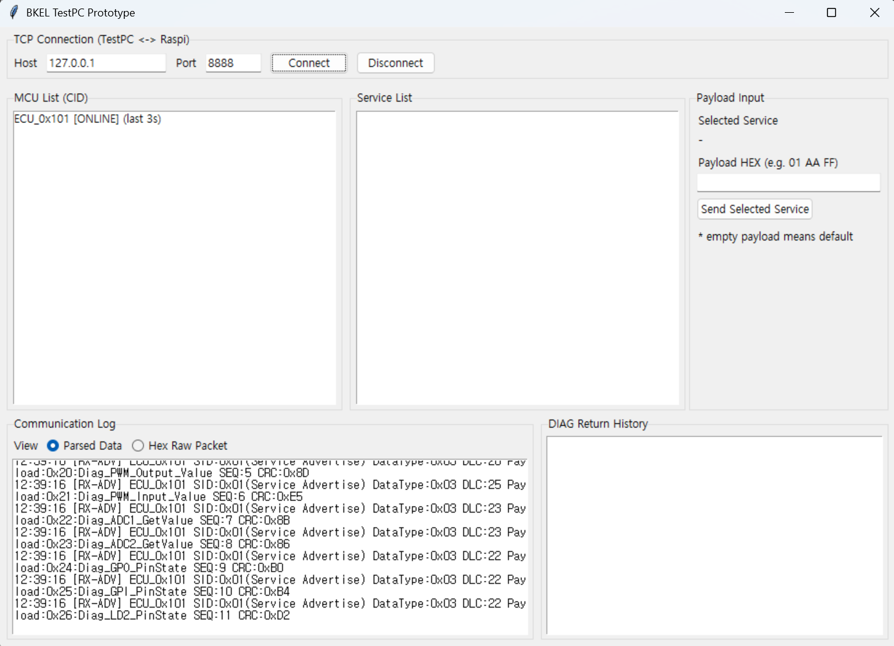
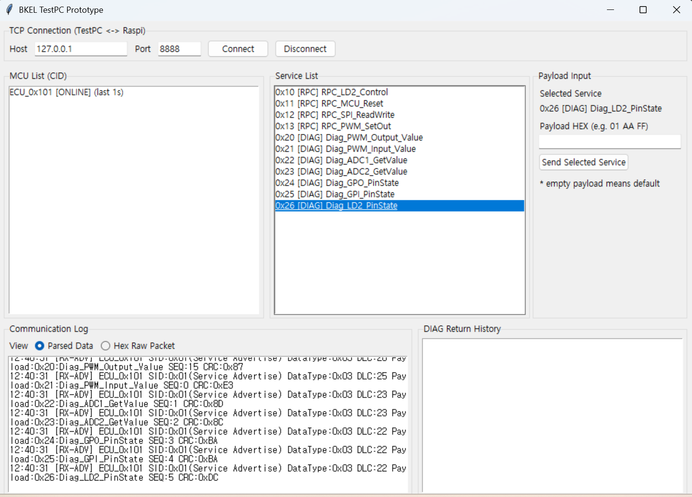

# BKEL_SomeIP_GateWay

- 본 저장소는, SOME/IP를 모사하여 제작한 커스텀 프로토콜을 사용합니다.
- 제한적인 리소스를 가진 MCU 내부에서 RPC, 진단통신을 지원합니다.
- 개인적인 스터디 모임에서 제작한 관계로 MCU - 브릿지 사이의 통신은 UART로 채택하였습니다. (CAN 으로 확장성 염두)
- 대략적인 통신흐름은 다음과 같습니다.
  
  > [MCU] <--UART--> [BRIDGE] <--TCP(TLS)--> [CLIENT]

## Source Code
  1. [STM32F103RB F/W](https://github.com/BKAELAB/BKEL_SomeIP_GateWay/tree/mcu) : move to mcu branch
  2. [Gateway Bridge APP](https://github.com/BKAELAB/BKEL_SomeIP_GateWay/tree/raspiapp) : move to gateway branch
     
## Communication Concept
  1. CLIENT accept to Well-Known IP (Ref. DDS)
  2. CLIENT can see all service information because MCU Send ALL Service ID&Info via Gateway periodcally
  3. MCU send message to GateWay by uart
  4. GateWay send message to client by tls(tcp)
  5. all packet is consist of our custom protocol (simiral SOME/IP)

## Features
  1. RPC (Remote Procedure Call)
  2. Diagnosis

## To be update
  1. To prepare for expandability, the existing UART communication method will be **replaced with a CAN BUS configuration.**
  2. Client authentication system scheduled to be introduced for security

## Docs
- [WIKIPAGE](https://github.com/BKAELAB/tsw_bringup_f103rb/wiki)

## TestPC Prototype (TCP GUI)
- `app/testpc_prototype.py` is a Python/Tkinter prototype client for `TestPC <-> Raspi` TCP communication.
- Internal modules are split under `app/testpc/` (`protocol`, `network`, `gui`, `mock_raspi_server`) to keep source manageable.
- It parses custom frames:
  - `SOF(0xAA) | SID(1) | DataType(1) | DLC(2) | Payload | CID(2) | CRC8(1)`
- Main prototype flow:
  1. Receive periodic `SID=0x01` service advertise from MCU (via Raspi)
  2. Build MCU list by CID in GUI
  3. Double-click MCU to show available services
  4. Double-click service to send request (RPC: fire-and-forget, DIAG: show response value)

### Run
```bash
python app/testpc_prototype.py
```

### Local Simulation (Mock Raspi)
Terminal #1:
```bash
python -m app.testpc.mock_raspi_server
```

Terminal #2:
```bash
python app/testpc_prototype.py
```
Then connect GUI to `127.0.0.1:8888`.

### Notes
- After `SOF`, the TestPC parser uses **full little-endian** for `SID`, `DataType`, `DLC` (`<BBH`) and for `CID | Seq` (`<H`). If your gateway sends **big-endian `DLC`**, switch `HEADER_FMT` in `app/testpc/protocol.py` back to `">BBH"` and keep only `<H` for CID.
- RX path currently only consumes/discards CRC8 1 byte (no CRC mismatch branch).
- If service advertise payload does not include explicit SID list (`0x10,0x22,...`), GUI falls back to known RPC/DIAG defaults.

### Demonstration


